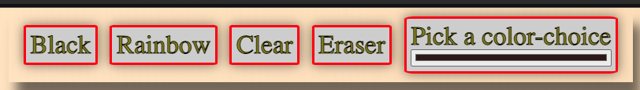
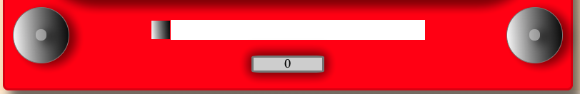

# Etch-A-Sketch Online Drawing Simulator

## Creator
  - Blain Crawford

Created as a way to simulate the fun of art creation with the toy Etch-A-Sketch re-imagined as a digital UI in 2021. 

## Deployed at:
https://blain-crawford.github.io/etch-a-sketch2/
   

## Technologies Used
  -  JavaScript
  -  CSS
  -  html

## Running the Application
 - Clone repostiory
 - Use LiveServer extension in VScode to run on localhost
 - Create grid of up to 100 by 100 boxes for maximum definition

 <video src="./images/grid-creation.mov" style=" width: 300px; border-radius: 10%;" autoplay loop></video>

 -  Choose a prefered drawing style from the toolbar, black lines, rainbow lines, or choose a color of your own and paint away!

 

 -  If you'd like to start over just click on clear, or reset the grid with slider at the bottom of the Etch-A-Sketch

 

## Just simply draw until your heart is content!

